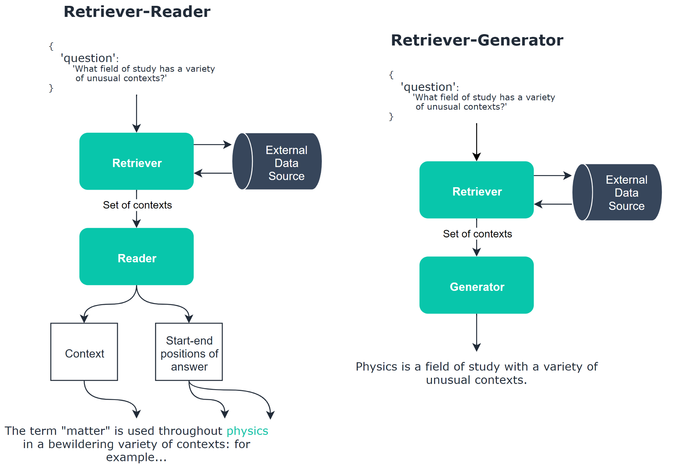

## Two types of model:  
1. Open domain: No context provided
2. Reading comprehension (closed domain): Not particularly useful for a lot of cases

## Open domain (ODQA)
1. retriever: Find relevant context
2. Reader: Take a span of text from that context
3. Generator: Will replace our reader model. Generator will take a question and generate an answer.

In this repo first we load SQuAD dataset then reformat it in the shape of Question/Context/Answer and then predict the answer using BERT QA model: 'deepset/bert-base-cased-squad2'

For more information on training BERT for QA please visit [here](https://towardsdatascience.com/how-to-train-bert-for-q-a-in-any-language-63b62c780014)